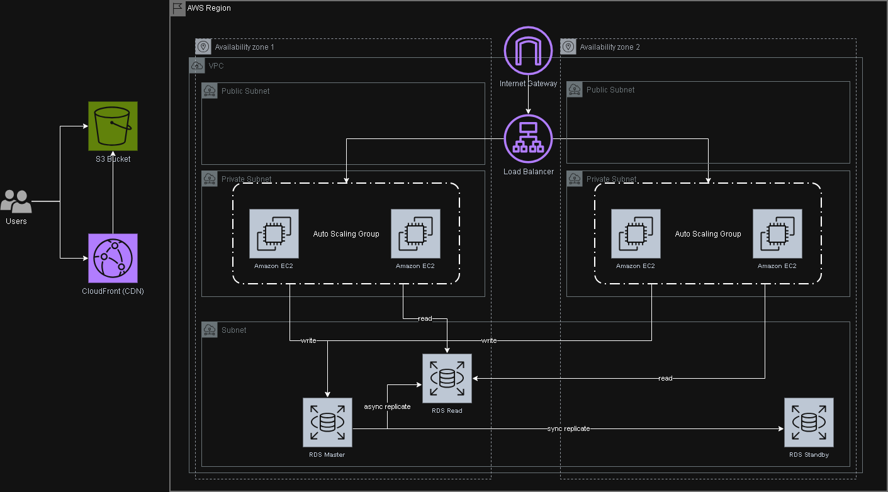

Provide your solution here:

for trading system, the key feature as below:
1. User Autehntication and wallet
2. Place order and market data

Cloud services:
1. CloudFront: to cache the frontend so users load faster
2. Application Load Balancer: to balance the connection (incoming request) among the available server.
3. EC2: virtual server for hosting the service
4. Auto-scaling group: automatically add more servers when traffic spikes and remove when traffic drops (costing purpose) 
5. Amzaon RDS PostgreSQL: stores user profiles, trading records and wallet info. With this, AWS auto create a standby database in ohter zone and synchronously copy the data from main to standby database (if the master database crashes, it automatically fails over). My proposal is to have 2 RDS, 1 for write only and another for the purpose on reading only (to speed up the data retriever)
6. Multi AZ: ensure system stays online during hardware failure
7. S3 Bukcet: all the data for web / frontend

Plans for Scaling:
1. Deploy the code with docker containers. Instead of using the general EC2 deployment, we can package the application into docker so it can be deploy faster.

[go back to main](/README.md)